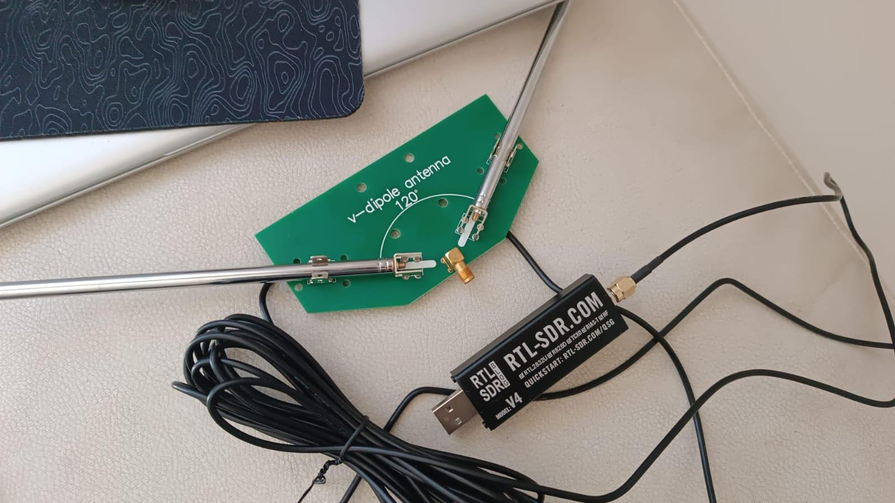
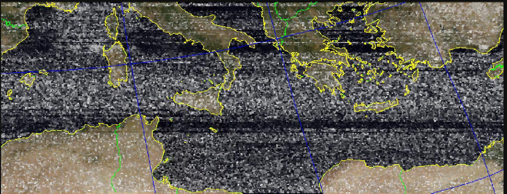
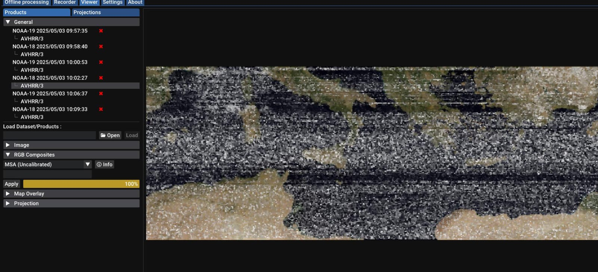
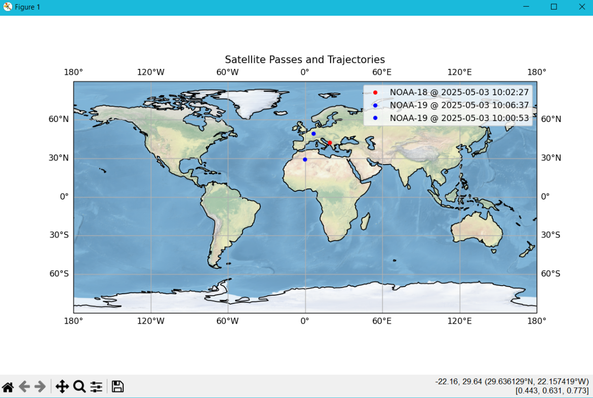

# Noaa Satellite Decoder & Tracker
NOAA Apt data Satellite decoder and image quality enhancer in python. NOAAs are american weather satellites, you can intercept them at 137mhz and receive live data from space, the data is mostly images. Once you record the signal, you can parse the images with several tools, this one not only converts raw data to images but also creates a map showing the tracked satellites. 

# 📡 Antennas & Materials
The materials i used are: 
- RTL SDR v4, or any other sdr receiver that operates at 137mhz;
- V-Dipole antenna, or any other antenna that recieves at uhf/vhf;
- Sdrpp software, or any other software that allows you to record incoming signals and save them in wav 16-bit 20800hz file format.
- (optional) Satdump software, if you want to entirely replace my code : (

# 💻 Code

### Parsing data from the wav 16bit recording: 
- First we take the wav file and resample it into 200800hz format if it isn't already;
- Then we modfify it to correct the signal, first we apply the hilbert transformaion for the iq, then we demodulate it to make it suitable for image representation;
- Then we syncronize the data to detect the start of each row, and start searching for rows;
- After filtering out the rows with a wrong lenght we stack them into a 2d image;
- Then we display the image (a small part is cut out for error handling);
- If upgraded through color correction, the image will look like the one on the right.

### Enhancing the image: 
Once obtained the image you can enhance it with softwares like Satdump, i tried making my own enhancer but failed. I don't really understand how Noaa rgb composites work, ion even know how satdump does it, i tried lots of different rgb composite, added mcir uncalibrated version, fake colors based on the position of the satellite but failed every time... best i could do was a green version of the raw_sync.png you get by default : (
Anyways once you enhance the image you also receive a dataset.json file which contains useful data on the satellite. 

### Tracking the satellite: 
  - First we collect all the json files containing info on the tracked images;
  -
  -
  

