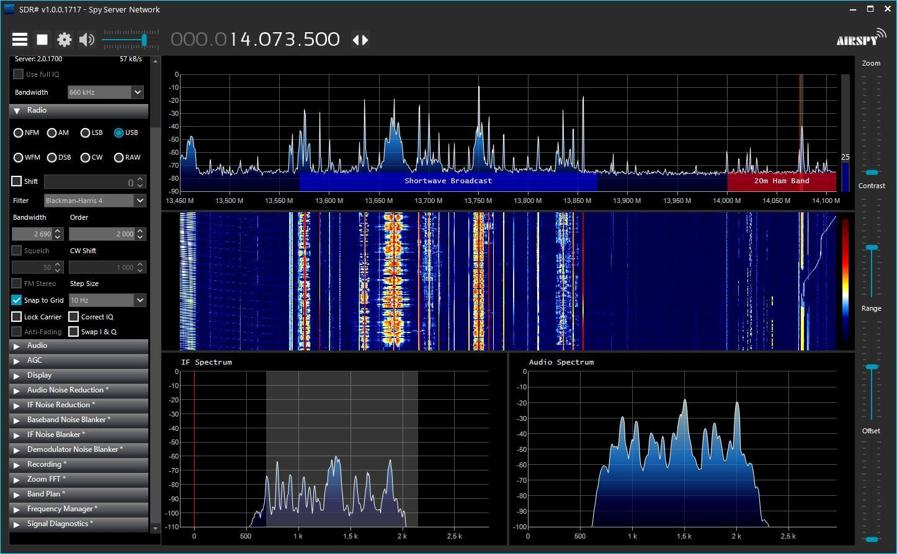

# Noaa Satellite Decoder & Tracker
NOAA Apt data Satellite decoder and image quality enhancer in python. NOAAs are american weather satellites, you can intercept them at 137mhz and receive live data from space, the data is mostly images. Once you record the signal, you can parse the images with several tools, this one not only converts raw data to images but also creates a map showing the tracked satellites. 

# 📡 Antennas & Materials

### Materials

The materials i used are: 
- RTL SDR v4, or any other sdr receiver that operates at 137mhz;
- V-Dipole antenna, or any other antenna that recieves at uhf/vhf;
- Sdrpp software, or any other software that allows you to record incoming signals and save them in wav 16-bit file format.
- (optional) Satdump software, if you want to entirely replace my code : (

# Receiving singals
 
First you need to record the signal using any free software (baseband or audio, 16-bit wav format) and upload the file in the same directory as this code's.

In order to do it plug the sdr radio you have in your pc, in my case i used a rtl sdr v4, be aware that the v4 requires new drivers which you will probably have to upload in satdump or sdrpp directories. The v3 version doesn't.

The sdr is plugged into a v-dipole antenna which aims at the sky, the antenna must have no obstacles in a 360° view, the sky view must be clean, no trees or metallic objects. 

Once all is set you need to wait for the satellite to pass, i will soon upload a code which displays the next passes of a satellite of your choice (yes i dislike gpredict and ion wanna have 10 n2yo.com tabs open).

Here's an example of the sdrpp software receiving signals, this sdrpp image is of an old version. Choose the opions: Audio, Wav, Int-16, Stream radio, ignore silence.

# 💻 Code 

### Parsing data from the wav 16bit recording: 
- First we resample the wav file into 200800hz format;
- Then we modfify it to correct the signal:
- We apply the hilbert transformaion for the iq;
- And we demodulate it to make it suitable for a png;
- Then we syncronize the data to detect the start of each row;
- We start searching for the rows and filter out the ones with a wrong lenght;
- Finally we stack them into a 2d image and we display it (a small part is cut out for error handling);
- If upgraded through color correction, the image will look like the one on the right.

### Enhancing the image: 
Once obtained the image you can enhance it with softwares like Satdump, i trie making my own enhancer but i don't really understand how Noaa rgb composites work nor how satdump does it, i tried lots of different rgb composites combinations, added mcir uncalibrated version, fake colors based on the position of the satellite but failed every time... best i could do was a green version of the raw_sync.png you get by default : (

### Tracking the satellite: 
Once you enhance the image you also receive a dataset.json file which contains useful data on the satellite. 

  - First we collect all the json files containing info on the received signals;
  - Second we define info such as color and name for each satellite, and we start creating the image;
  - For each dataset we extract the data of the satellite and upload it onto the image;
  - Finally we adjust the timezone, pin the satellite trajectory on the map and display the image.
